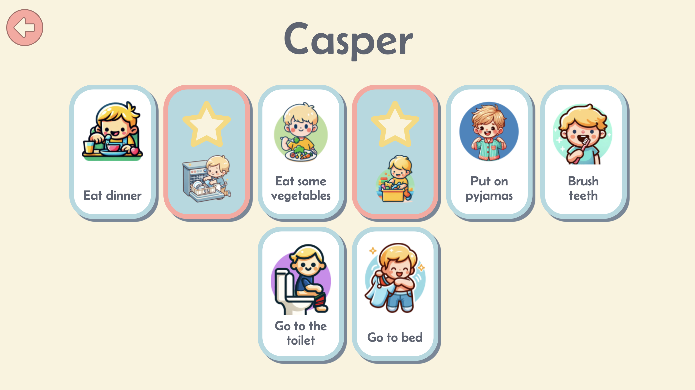

# Mini Routini



## 🚀 About the Project
Mini Routini is a small web app designed to help kids complete their household chores in a fun and interactive way. The app provides a list of daily tasks as cards that can be flipped as completed, helping kids stay on track with their responsibilities. It is designed with simplicity and child-friendliness in mind.

## 🎨 Features
- 🌞 **Morning and Evening Chore Lists** – Separate lists for structured routines.
- 💾 **Local Storage** – Saves progress so kids can continue where they left off.
- 🎨 **Simple UI** – Child-friendly interface for easy navigation.
- 🔒 **Locked Settings** – Prevents unauthorized changes by children.
- 📏 **Optimized for Tablets & Desktops** – Designed for screens kids actually use.
- 🎵 **Reward Page** – Unlocks a favorite YouTube video upon task completion.

## 🌍 Live Demo
Visit the live site: [Mini Routini](https://www.miniroutini.com/)

## 🛠️ Tech Stack
- **Frontend**: HTML5, CSS3 (Sass), JavaScript
- **Frameworks**: Bootstrap
- **Storage**: Local Storage
- **Development Tools**: Node.js, npm
- **Hosting**: Netlify

## 📦 Installation & Setup
To run this project locally, follow these steps:

### 1️⃣ Clone the Repository
```bash
git clone https://github.com/thislily/MiniRoutini.git
cd MiniRoutini
```

### 2️⃣ Install Dependencies
```bash
npm install
```

### 3️⃣ Start Development Mode
```bash
npm run watch
```

## 📬 Contact
For any inquiries or feedback, feel free to reach out:
📧 [lilywatson.dev@gmail.com](mailto:lilywatson.dev@gmail.com)

---
**Made by Lily Watson**


